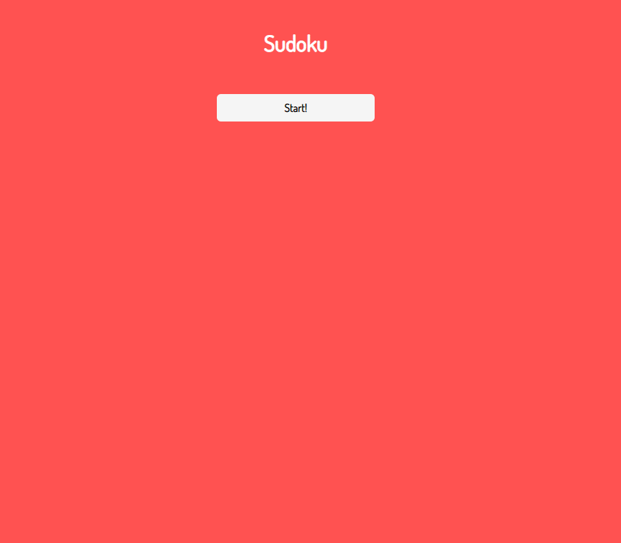

# VueJs-Experiments
This repository contains some experiments with Vue.js framework.

&nbsp;

## Todo list application

An interactive to-do list with style and animations: add a todo item, set completed, remove it

[The article with step-by-step tutorial](https://medium.com/better-programming/how-to-build-your-first-vue-js-application-469ed1ec4fde)

&nbsp;

## Instant search application

Fetch data from a Web API and add a dynamic filter with computed properties

[The article with step-by-step tutorial](https://medium.com/better-programming/instant-search-with-vue-js-and-axios-5b78a3a59f01)

&nbsp;

## Switchable GridView ListView

Represent any array of data and switch between visualizations

[The article with step-by-step tutorial](https://medium.com/better-programming/switching-between-grid-view-and-list-view-with-vue-js-90fcd578bbdf)

&nbsp;

## Sudoku

How to code this simple game from A to Z

[The article with step-by-step tutorial](https://medium.com/better-programming/how-to-build-sudoku-in-vue-js-f97509b523ed)

