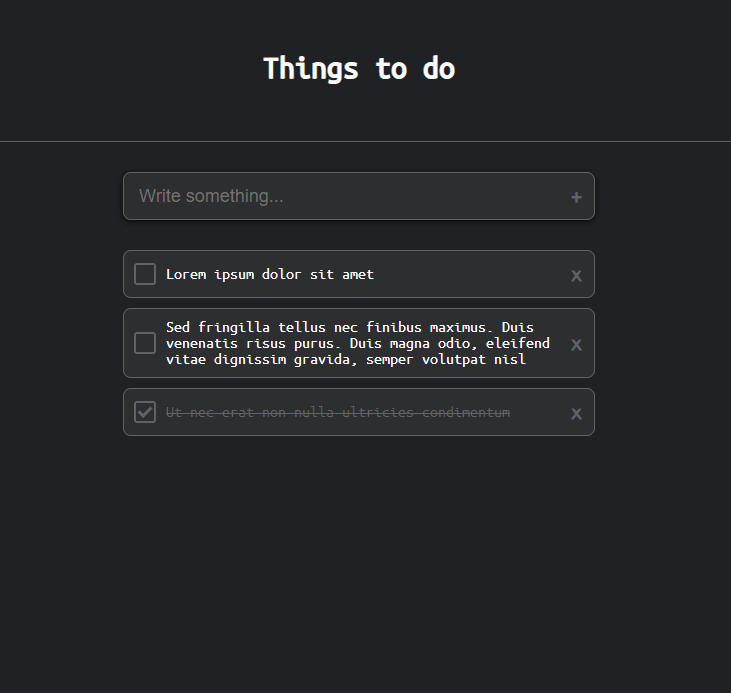
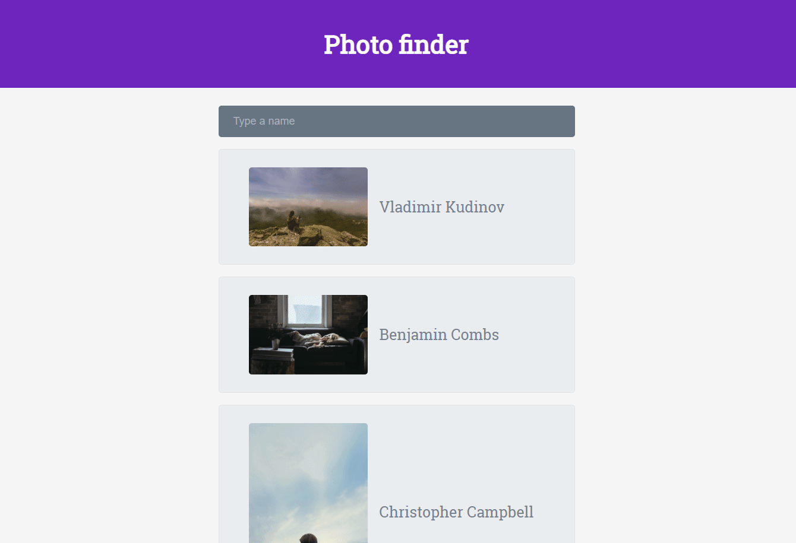

# VueJs-Experiments
This repository contains some experiments with Vue Js framework.

&nbsp;

## Todo list application

An interactive to-do list with style and animations: add a todo item, set completed, remove it. 

[The article with step-by-step tutorial](https://medium.com/better-programming/how-to-build-your-first-vue-js-application-469ed1ec4fde)

&nbsp;

## Instant search application

